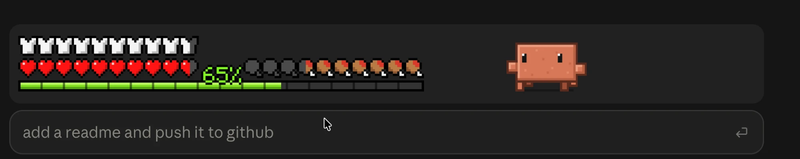

# clawd-minecraft

A Claude Code mod that shows your usage as a Minecraft HUD (with Clawd walking around next to it). It sits right above the prompt box in the Claude desktop app.



- **Hearts and armor:** how much of your 7-day limit is left
- **XP bar and number:** how much of your 5-hour limit is left (the number is the % remaining)
- **Hunger:** how much of the context window is left
- **Clawd:** paces around, flags you down under flashing "?"s for as long as a question waits on you, and keeps jumping under fireworks once a turn finishes, until you send the next prompt

A bar stays blank until Claude Code has a reading for it (nothing is guessed), and a limit whose reset time has already passed shows as full.

If your system is set to reduce motion, Clawd stands still instead of walking around. And if another mod draws in the same spot above the prompt, it keeps its place right under the HUD.

## Install

You need Claude Code 2.1.287 or later (mods are on by default from there, no flag needed). The hearts, armor and XP bar also need a Claude subscription, since they read your plan's limits (without one you still get hunger and Clawd). Run these two in a terminal:

```bash
claude plugin marketplace add amsultan2010/clawd-minecraft
claude plugin install clawd-minecraft@clawd-minecraft
```

Then start a new session in the desktop app's Code tab. The HUD shows up after Claude's first reply.

## Or let Claude do it

Paste this into Claude Code (the Code tab works too):

```
Install the clawd-minecraft mod for me. Run `claude plugin marketplace add amsultan2010/clawd-minecraft` and then `claude plugin install clawd-minecraft@clawd-minecraft`, and tell me when it's done so I can start a new session.
```

## What it touches

It reads your usage numbers (the 5-hour and 7-day limits and the context window) and draws the HUD. That's it. No network calls, no file access, no shell commands.

It also notices when Claude asks you a question and when a turn starts or finishes (that's how Clawd knows when to react), but it never changes or blocks anything. Run `claude plugin validate .` in this repo if you want to see every hook and call for yourself.

## Contributing

Issues and pull requests are welcome. Before you open a PR, make sure these two still pass:

```bash
claude plugin validate .
claude plugin test .
```

## License

[MIT](LICENSE). That covers the code and the pixel art in this repo (all redrawn from scratch).

This is a fan project and isn't affiliated with Mojang, Microsoft or Anthropic. Minecraft and Clawd belong to their owners, and the license doesn't give you any rights to those names or characters.
